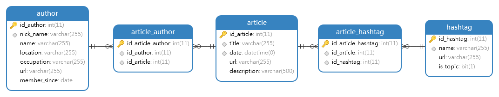

# data-mining-itc-cnet

### Project description
This project is a Python web scraper required for the course **"Fellows - Data 
Science & Machine Learning"**, part of the Israel Tech Challenge Academy. More 
information can be found by visiting [itc.tech](https://www.itc.tech/).

Our specific project scrapes the top stories at CNET's news portal, 
[cnet.com/news](https://www.cnet.com/news/). It gets the URLs for the top
stories in the main site, and then scrapes each of the URLs gathering the title,
description, author/s and published data.

We've found so far two different site structures for Cnet's stories, and we will
try to scrape following these patterns. In case our scrapers finds an unknown 
pattern, it will not scrape it and save an error message in that case. Examples
of these two patterns are 
[this one](https://www.cnet.com/news/windows-11-everything-we-want-to-see-in-the-new-microsoft-os/)
and [this one](https://www.cnet.com/features/gps-rules-everything-a-satellite-launch-this-week-keeps-its-upgrade-rolling/).

Also, the scraper can also integrate data for articles coming from The New York
Times (TNYT) given the correct parameters.

### Requirements
This project was built using **Python 3.8.2**, so make sure you're running that 
version.
Create a virtual environment using `venv` and install all the dependencies 
listed in the file `requirements.txt` by running:

`pip install -r requirements.txt`

In order to run the scraper in `author` mode, Selenium is used to scrape the 
URLs and it requires a ChromeDriver that can be downloaded from 
[here](https://chromedriver.chromium.org/downloads). Note: the chrome driver
version needs to match your local Chrome version (Google Chrome is a 
requirement).

Save the `chromedriver` executable inside the folder `/chromedriver/` in this
project.

In order to be able to query TNYT's API, you need to register [here](https://developer.nytimes.com/)
and get an API key for the Top Stories API. In order to do it, navigate to the
site and log in to your account. Click on your email in the top right > Apps. 
Create a new app and enable the Top Stories API. Copy the API Key to the 
`settings.py` variable `API_KEY`.

### Running the scraper
In order to run the scraper, activate your virtual environment and run:

`python main.py [-h] [-a AUTHOR] [-t TAG] [-c] [-v] {top_stories,tag,author} 
--api science`

* Mandatory arguments:
    - mode: can be `top_stories`, `tag` or `author`.
    - `-a --author`: author to scrape if mode = `author`.
    - `-t --tag`: tag to scrape if mode = `tag`.
* Optional arguments:
    - `--api {science, technology}`: query TNYT's API for science or technology 
      articles.
    - `-n --number`: limit the number of stories to scrape.
    - `-h --help`: get help for running the scraper.
    - `-c --console`: print the results to the console instead of saving them.
    - `-v --verbose`: log status information to the console while running the 
      scraper.
      

### Database design
In order to save the scraped information as well as to give it a better sense, a database 
was designed. In order to work with this database, the script `data_mining.sql` must be executed. 
Below is a view of the structure of the tables that make up said database.

In order to configure the connection with the database, 
you must go to the `settings.py` file and configure 
the `HOST`, `USER` and `PASSWORD`  of the database. Leave the `DATABASE` 
variable as it is.

### Authors
- [Nicolas Macian](https://github.com/nmacianx/)
- [Alejandro Alberto Vidaurrázaga Iturmendi](https://github.com/Alejandro-Vidaurrazaga)